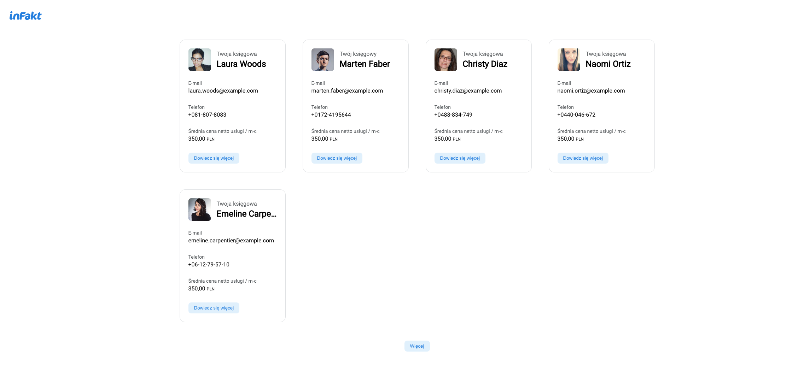
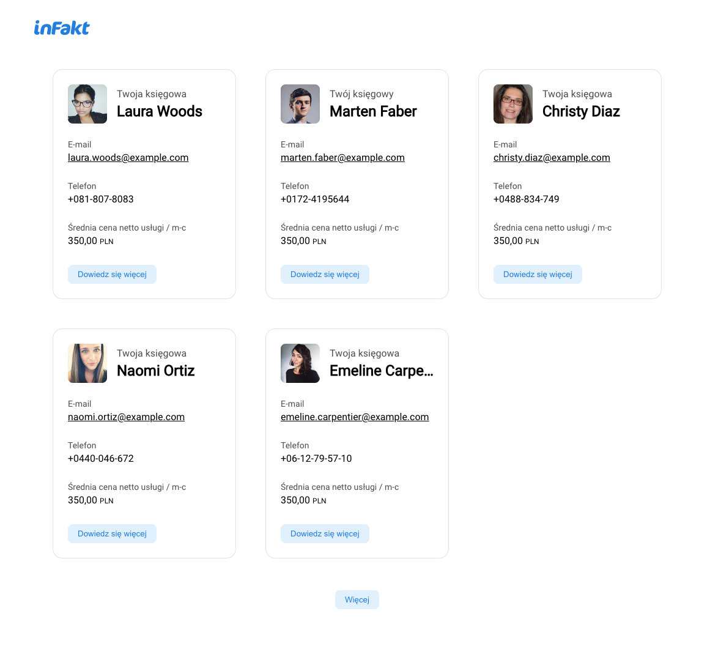
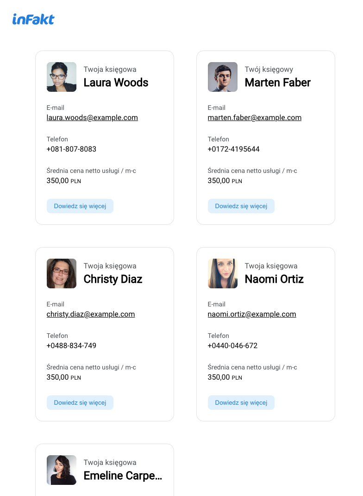
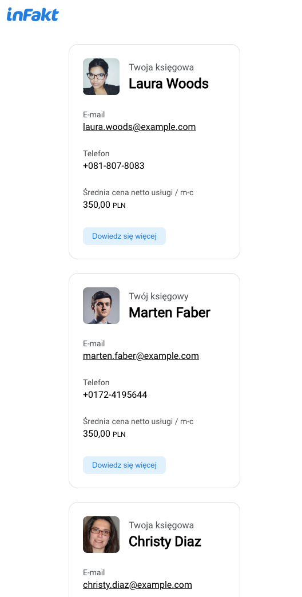

# Getting Started with Create React App

This project was bootstrapped with [Create React App](https://github.com/facebook/create-react-app).

## Available Scripts

In the project directory, you can run:

### `yarn start`

Runs the app in the development mode.\
Open [http://localhost:3000/ksiegowi](http://localhost:3000) to view it in the browser.

## Production

This project is deployed here https://accountant-app-c9eb0.web.app/ksiegowi

## Preview in different screens

